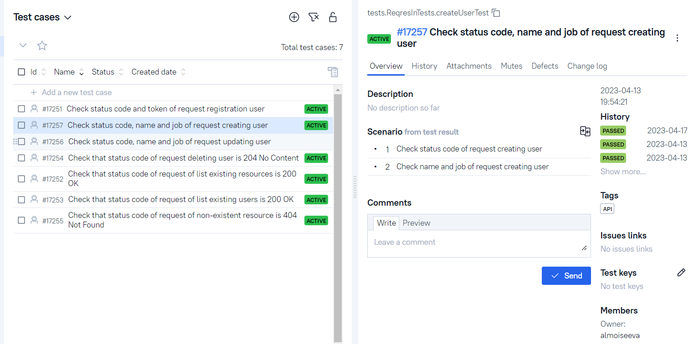
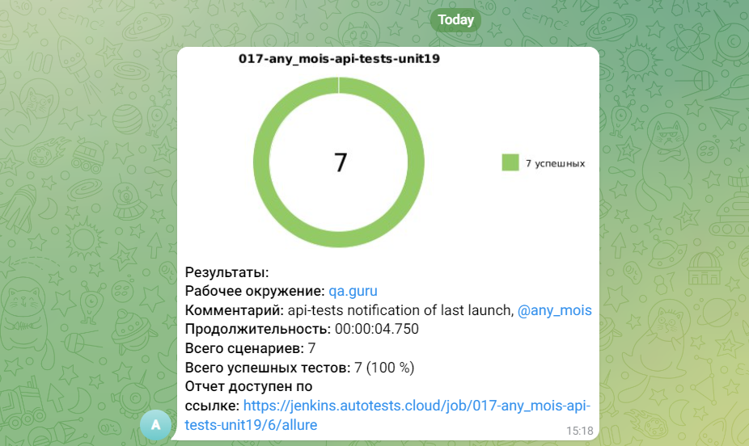

# Проект по тестированию для сайта "Reqres.in"
<a target="_blank" href="https://https://reqres.in/">Вэб сайт "Фридом Финанс"</a>

## :pushpin: Содержание:

- [Технологии и инструменты](#earth_africa-технологии-и-инструменты)
- [Реализованные тесты](#earth_africa-Реализованные-проверки)
- [Сборка в Jenkins](#earth_africa-Jenkins-job)
- [Запуск из терминала](#earth_africa-Запуск-тестов-из-терминала)
- [Allure отчет](#earth_africa-Allure-отчет)
- [Интеграция с Allure TestOps](#earth_africa-Интеграция-с-Allure-TestOps)
- [Отчет в Telegram](#earth_africa-Уведомление-в-Telegram-при-помощи-бота)

## :rocket: Технологии и инструменты

<p align="center">
<a href="https://www.jetbrains.com/idea/"></a>
<a href="https://www.java.com/"></a>
<a href="https://github.com/"></a>
<a href="https://junit.org/junit5/"></a>
<a href="https://gradle.org/"></a>
<a href="https://github.com/allure-framework/allure2"></a>
<a href="https://www.jenkins.io/"></a>
</p>

## :scroll: Реализованные тесты

- ✓ Check that status code of request of list existing users is 200 OK.
- ✓ Check that status code of request of list existing resources is 200 OK.
- ✓ Check that status code of request of non-existent resource is 404 Not Found.
- ✓ Check status code, name and job of request creating user.
- ✓ Check status code and token of request registration user.
- ✓ Check status code, name and job of request updating user.
- ✓ Check that status code of request deleting user is 204 No Content.

## </a> Jenkins job
<a target="_blank" href="https://jenkins.autotests.cloud/job/017-any_mois-api-tests-unit19/5/">Сборка в Jenkins</a>
<p align="center">
</a>
</p>

## :computer: Запуск тестов из терминала

Локальный запуск:
```bash
gradle clean api_test
```

Удаленный запуск:
```bash
clean api_test
```

## </a> Отчет в <a target="_blank" href="https://jenkins.autotests.cloud/job/017-any_mois-cifra-broker-tests/allure/">Allure report</a>

### Основное окно

<p align="center">

</p>

### Тесты

<p align="center">

</p>

### Гафики

<p align="center">

</p>

## </a>Интеграция с <a target="_blank" href="https://allure.autotests.cloud/launch/19377">Allure TestOps</a>

### Дашборд

<p align="center">

</p>

### Тест-кейсы

<p align="center">

</p>


## </a> Уведомление в Telegram при помощи бота

<p align="center">

</p>

